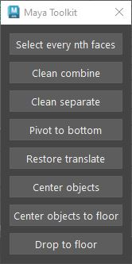
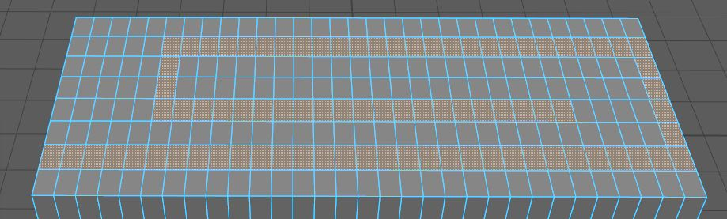
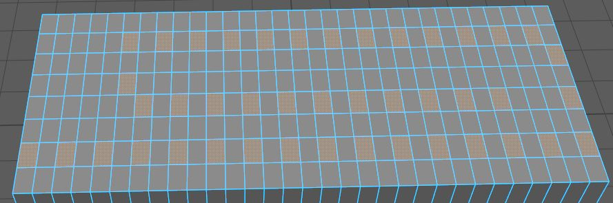

# MAYA TOOLKIT

This toolkit will have more and more useful scripts that can speed up repetitive tasks.

## INTERFACE

### Select every nth faces

You select some continuous faces.

Then you click on *select every nth faces* and type the number you want.

