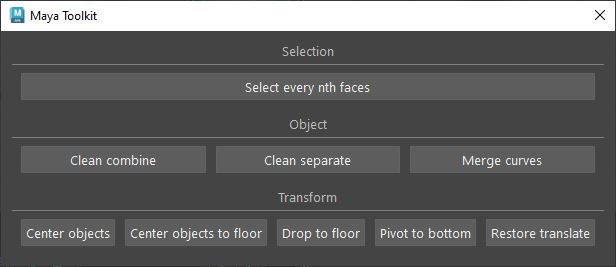
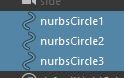

# MAYA TOOLKIT

This toolkit will have more and more useful scripts that can speed up repetitive tasks.

## INTERFACE

## Select every nth faces

You select some continuous faces.

Then you click on *select every nth faces* and type the number you want.

## Clean combine and clean separate

This tool combine and separate and clean history.

## Pivot to bottom

Translate on the y-axis your object pivot to the lowest point.

## Restore translation

Restore the xform translate to worldspace.

## Center objects

Center selected objects to the world center.

## Center objects to floor

Move selected objects to the center on the grid.

## Drop to floor

Move selected objects on the grid only on the y-axis.

## Merge curves

Merge multiple curves into one.

